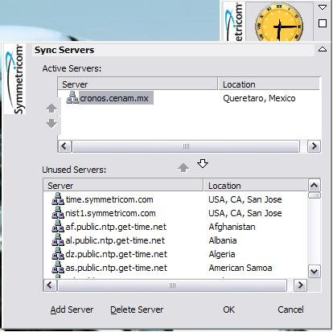

# Consultando la hora desde NTP



Cuando de trata de registrar eventos via una aplicación especialmente cuando son del tipo legalmente relevantes hay que tomar un par de consideraciones con respecto a donde sacar la fecha y hora, ya que obtener esta información desde el equipo, aunque es la opción mas eficiente y confiable, presenta un problema la posibilidad de que por desperfectos técnicos o acciones maliciosas la fecha del sistema sea incorrecta y por tanto los reportes y documentos que genere tengan una fecha incorrecta, algo nada recomendable en documentos de indole legal.

Pero hay una forma de prevenir ese problema, consultar el tiempo directo desde internet via el Protocolo de Tiempo de Red (NTP), ya que los servidores NTP son manejado por organizaciones con la capacidad de asegurar su integridad y se sincronizan dando una garantia de que la hora obtenida de estos es la adecuada para documentos legalmente relevantes.

Todo esto suena muy bien, asi que veamos como se hace.

## Servidores NTP.
Para poder consultar la hora via el protocolo NTP el primer paso es tener la URL del servidor o servidores que deseamos consultar, para esto se recomienda consultar un servidor que este cercano a su ubicación, la lista completa la puede consultar desde la pagina https://www.ntppool.org/es/ la cual contiene el listado de servidores conocidos agrupados por pais, a su vez es posible que halla otros servidores cercanos, usualmente mantenidos por observatorios astronomicos o instancias gubernamentales, como el caso del servidor NTP del Centro Nacional de Metrología aquí en México, cuya dirección es cronos.cenam.mx .

Ya que tenga en claro a cual servidor o servidores se conectará podemos proceder.

## Consultando un servidor NTP.
Para consulta el servidor NTP haremos uso de la líbreria Apache Commons Net, la cual nos proporcionara de todo lo necesario, de esta usaremos las siguientes clases:

* NTPUDPClient - El cliente para consultar un servidor usando el protocolo NTP
* InetAddress - Esta clase representa una dirección IP
* TimeInfo - Clase para almacenar los paquetes respuesta del protocolo NTP

La forma en que procederemos es la siguiente:

1. Crearemos un objeto de tipo NTPUDPClient
2. Crearemos un arreglo con las direciones web de los servidores NTP
3. Usando una de esas direciones crearemos un objeto InetAddress
4. Usaremos el método *getTime* de NTPUDPCliente para consultar la hora en la dirección del objeto que creamos en el paso anterior
5. Si la operación de consulta ocurre correctamente regresamos el resultado.
6. En caso contrario obtenemos la siguiente dirección y repetimos desde el paso 3
7. Si se agotan las direcciones disponibles, finalizamos la conexión
8. Regresaremos la hora del sistema como ultimo recurso.

Notara que el caso donde la consulta falle esta contemplado, esto es necesario para prevenir que un evento donde no tenga internet cause que su programa sufra una falla que lo tire.

Ahora veamos como se hace.

## Ejemplo

Primero la clase con la función que consulta los servidores NTP.

```java
package mx.hash.ejemplontp;

import java.io.IOException;
import java.net.InetAddress;
import java.util.Date;
import java.util.logging.Level;
import java.util.logging.Logger;

import org.apache.commons.net.ntp.NTPUDPClient;
import org.apache.commons.net.ntp.TimeInfo;

public class NTPService {

    static private final Logger LOGGER = Logger.getLogger("mx.hash.ejemplontp.NTPService");

    public Date getNTPDate() {
        String[] hosts = new String[]{"cronos.cenam.mx", "2.mx.pool.ntp.org"};

        Date fechaRecibida;
        NTPUDPClient cliente = new NTPUDPClient();
        cliente.setDefaultTimeout(5000);
        for (String host : hosts) {
            try {
                LOGGER.log(Level.INFO, "Obteniendo fecha desde: {0}", host);
                InetAddress hostAddr = InetAddress.getByName(host);
                TimeInfo fecha = cliente.getTime(hostAddr);
                fechaRecibida = new Date(fecha.getMessage().getTransmitTimeStamp().getTime());
                return fechaRecibida;
                
            } catch (IOException e) {
                LOGGER.log(Level.SEVERE, "NO SE PUDO CONECTAR AL SERVIDOR {0}", host);
                LOGGER.log(Level.SEVERE, e.getMessage(), e);
            }
        }
        
        LOGGER.log(Level.WARNING, "No se pudo conectar con servidor, regresando hora local");
        cliente.close();
        return new Date();
    }
}
```

Y nuestra clase main para poder ejecutar el programa

```java
package mx.hash.ejemplontp;

import java.util.Date;
import java.util.logging.Level;
import java.util.logging.Logger;

/**
 *
 * @author david
 */
public class App {
    static private final Logger LOGGER = Logger.getLogger("mx.hash.ejemplontp.App");
    
    static public void main(String[] args){
        NTPService servicioNTP = new NTPService();
        LOGGER.log(Level.INFO, "Obteniendo fecha desde el servidor NTP");
        
        Date fecha = servicioNTP.getNTPDate();
        
        System.out.println("");
        System.out.println("");
        System.out.println("Fecha-Hora NTP: " + fecha);
    }    
}
```

Obviamente necesitara agregar las librerias Apache Commons Net a su proyecto para poder compilar y ejecutar este programa, ya que lo haya hecho y el programa haya compilado ejecute el programa y vera una salida como la siguiente.

```
ago 10, 2019 2:18:21 AM mx.hash.ejemplontp.App main
INFORMACIÓN: Obteniendo fecha desde el servidor NTP
ago 10, 2019 2:18:21 AM mx.hash.ejemplontp.NTPService getNTPDate
INFORMACIÓN: Obteniendo fecha desde: cronos.cenam.mx


Fecha-Hora NTP: Sat Aug 10 02:18:21 CDT 2019
```

Y para demostrar que el programa es capaz de manejar un caso donde no tenga internet, desconectese de internet y ejecutelo de nuevo.

```
ago 10, 2019 2:16:33 AM mx.hash.ejemplontp.App main
INFORMACIÓN: Obteniendo fecha desde el servidor NTP
ago 10, 2019 2:16:33 AM mx.hash.ejemplontp.NTPService getNTPDate
INFORMACIÓN: Obteniendo fecha desde: cronos.cenam.mx
ago 10, 2019 2:16:33 AM mx.hash.ejemplontp.NTPService getNTPDate
GRAVE: NO SE PUDO CONECTAR AL SERVIDOR cronos.cenam.mx
ago 10, 2019 2:16:33 AM mx.hash.ejemplontp.NTPService getNTPDate
GRAVE: cronos.cenam.mx: Name or service not known
java.net.UnknownHostException: cronos.cenam.mx: Name or service not known
        at java.net.Inet6AddressImpl.lookupAllHostAddr(Native Method)
        at java.net.InetAddress$2.lookupAllHostAddr(InetAddress.java:929)
        at java.net.InetAddress.getAddressesFromNameService(InetAddress.java:1324)
        at java.net.InetAddress.getAllByName0(InetAddress.java:1277)
        at java.net.InetAddress.getAllByName(InetAddress.java:1193)
        at java.net.InetAddress.getAllByName(InetAddress.java:1127)
        at java.net.InetAddress.getByName(InetAddress.java:1077)
        at mx.hash.ejemplontp.NTPService.getNTPDate(NTPService.java:30)
        at mx.hash.ejemplontp.App.main(App.java:23)
        at sun.reflect.NativeMethodAccessorImpl.invoke0(Native Method)
        at sun.reflect.NativeMethodAccessorImpl.invoke(NativeMethodAccessorImpl.java:62)
        at sun.reflect.DelegatingMethodAccessorImpl.invoke(DelegatingMethodAccessorImpl.java:43)
        at java.lang.reflect.Method.invoke(Method.java:498)
        at org.codehaus.mojo.exec.ExecJavaMojo$1.run(ExecJavaMojo.java:282)
        at java.lang.Thread.run(Thread.java:748)

ago 10, 2019 2:16:33 AM mx.hash.ejemplontp.NTPService getNTPDate
INFORMACIÓN: Obteniendo fecha desde: 2.mx.pool.ntp.org
ago 10, 2019 2:16:33 AM mx.hash.ejemplontp.NTPService getNTPDate
GRAVE: NO SE PUDO CONECTAR AL SERVIDOR 2.mx.pool.ntp.org
ago 10, 2019 2:16:33 AM mx.hash.ejemplontp.NTPService getNTPDate
GRAVE: 2.mx.pool.ntp.org: Name or service not known
java.net.UnknownHostException: 2.mx.pool.ntp.org: Name or service not known
        at java.net.Inet6AddressImpl.lookupAllHostAddr(Native Method)
        at java.net.InetAddress$2.lookupAllHostAddr(InetAddress.java:929)
        at java.net.InetAddress.getAddressesFromNameService(InetAddress.java:1324)
        at java.net.InetAddress.getAllByName0(InetAddress.java:1277)
        at java.net.InetAddress.getAllByName(InetAddress.java:1193)
        at java.net.InetAddress.getAllByName(InetAddress.java:1127)
        at java.net.InetAddress.getByName(InetAddress.java:1077)
        at mx.hash.ejemplontp.NTPService.getNTPDate(NTPService.java:30)
        at mx.hash.ejemplontp.App.main(App.java:23)
        at sun.reflect.NativeMethodAccessorImpl.invoke0(Native Method)
        at sun.reflect.NativeMethodAccessorImpl.invoke(NativeMethodAccessorImpl.java:62)
        at sun.reflect.DelegatingMethodAccessorImpl.invoke(DelegatingMethodAccessorImpl.java:43)
        at java.lang.reflect.Method.invoke(Method.java:498)
        at org.codehaus.mojo.exec.ExecJavaMojo$1.run(ExecJavaMojo.java:282)
        at java.lang.Thread.run(Thread.java:748)

ago 10, 2019 2:16:33 AM mx.hash.ejemplontp.NTPService getNTPDate
ADVERTENCIA: No se pudo conectar con servidor, regresando hora local

Fecha-Hora NTP: Sat Aug 10 02:16:33 CDT 2019
```

Como puede observar en la salida el programa recorrio el listado de servidores tratando de conectarse y no fue sino hasta que agotó las opciones que recurrio a la hora local.

